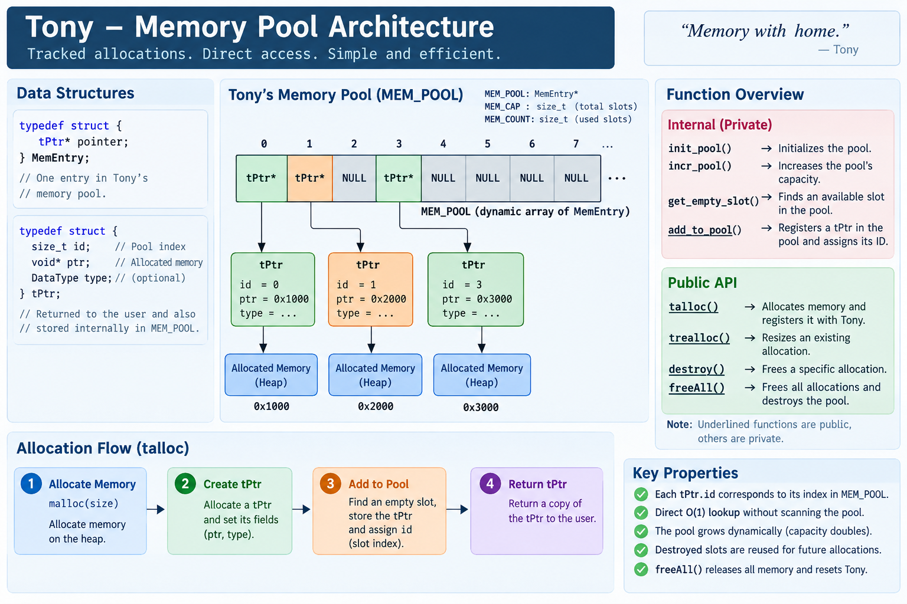

# Tony

Tony is **Cobalt's memory management system**. It provides tracked memory allocation through **tPtr** handles, allowing allocated memory to be registered, resized, individually destroyed, or completely released through a single memory pool.



## How it works

**Tony** uses a structure called **MemEntry** to store **pointers to `tPtr`**.

### tPtr - Tony's Pointer

A **tPtr** is a structure that stores a memory pointer along with metadata about that allocation.

```C
typedef struct {
    size_t id;
    void* ptr;
    DataType type;
} tPtr;
```

> You will find its definition at [dtypes.h](../include/cobalt/dtypes.h#L15-L19).

It consists of:

* **id** - The index or position at which this `tPtr` is stored in the memory pool. It is explained properly in the memory pool section.
* **ptr** - Points to the allocated data. Tony keeps track of this pointer.
* **type** - Stores the type of data associated with the allocation.

> You can see the available and supported data types in [dtypes.h](../include/cobalt/dtypes.h#L4-L13).

Tony uses `tPtr` to associate additional information with a memory allocation. Since a `void*` does not contain runtime type information, the `type` field can be used by Cobalt to keep track of the type associated with the allocated data.

### MemEntry - Memory Entry for Memory Pool

**MemEntry** is a structure that contains a **pointer to a `tPtr`**, not the `tPtr.ptr` allocation itself.

```C
typedef struct {
    tPtr* pointer;
} MemEntry;
```

> You will find its definition at [tony.c](../src/cobalt/tony.c#L19-L21).

Tony uses `MemEntry` internally to store pointers to `tPtr`, and each `MemEntry` is stored in the **Memory Pool**.

This design also leaves room for additional fields to be added to each pool entry in the future.

### MEM_POOL - Tony's Memory Pool

**Tony's Memory Pool** is a dynamic array of **MemEntry**:

```C
MemEntry* MEM_POOL;
```

It is managed by the following internal and public functions:

* **init_pool()** → Initializes the memory pool.
* **incr_pool()** → Increases the pool's capacity.
* **get_empty_slot()** → Finds an available slot in the pool.
* **add_to_pool()** → Registers a `tPtr` in the pool and assigns its ID.
* <u>***talloc()***</u> → Allocates memory and registers it with Tony.
* <u>***trealloc()***</u> → Resizes an existing Tony allocation.
* <u>***destroy()***</u> → Frees a specific Tony allocation.
* <u>***freeAll()***</u> → Frees all allocations and destroys the pool.

> Underlined functions are public while the others are private.

### How the pieces connect

Tony maintains the following relationship:

```text
MEM_POOL
   |
   +-- MemEntry
   |      |
   |      +-- tPtr
   |           |
   |           +-- id
   |           +-- ptr ------> allocated memory
   |           +-- type
   |
   +-- MemEntry
          |
          +-- tPtr
               |
               +-- id
               +-- ptr ------> allocated memory
               +-- type
```

The `tPtr.id` corresponds directly to the index of its `MemEntry` in `MEM_POOL`.

This allows Tony to locate an allocation directly without scanning the entire pool.

---

# Usage

## Allocating Memory

Use `talloc()` to allocate memory through Tony.

```C
#include <cobalt/tony.h>

int main(void)
{
    tPtr data = talloc(100);

    if (data.ptr == NULL) {
        return 1;
    }

    /* Use data.ptr */

    destroy(data);

    return 0;
}
```

`talloc()` allocates the requested number of bytes and registers the allocation in Tony's memory pool.

The returned `tPtr` contains the allocation's pool ID and memory pointer.

---

## Using Allocated Memory

Since `tPtr.ptr` is a `void*`, it can be cast to the type of data being stored.

For example:

```C
#include <cobalt/tony.h>

int main(void)
{
    tPtr data = talloc(sizeof(int));

    if (data.ptr == NULL) {
        return 1;
    }

    int *value = (int *)data.ptr;
    *value = 42;

    printf("Value: %d\n", *value);

    destroy(data);

    return 0;
}
```

Tony tracks the allocation, while the user is responsible for interpreting `tPtr.ptr` as the appropriate C type.

---

## Reallocating Memory

Use `trealloc()` to resize an existing Tony allocation.

```C
tPtr buffer = talloc(10);

if (buffer.ptr == NULL) {
    return 1;
}

tPtr resized = trealloc(buffer, 100);

if (resized.ptr == NULL) {
    destroy(buffer);
    return 1;
}

buffer = resized;

/* buffer.ptr now refers to the resized allocation */

destroy(buffer);
```

`trealloc()` uses `realloc()` internally.

Because `realloc()` may move the allocation to a different memory address, the returned `tPtr` must be used.

For example:

```text
Before:
tPtr.ptr → 0x1000

After:
tPtr.ptr → 0x5000
```

The pool entry is updated automatically by Tony.

The `tPtr.id`, however, remains the same because the allocation still occupies the same pool slot.

---

## Multiple Allocations

Tony can track multiple allocations simultaneously.

```C
tPtr a = talloc(10);
tPtr b = talloc(20);
tPtr c = talloc(30);
```

The memory pool may look like:

```text
Tony Memory Pool
----------------
CAP: 4 | USED: 3

 ID   PTR
------------
  0   0x...
  1   0x...
  2   0x...
  3   -
```

Each allocation receives a unique ID while it is active.

```text
a → ID 0
b → ID 1
c → ID 2
```

The ID is the index of the corresponding entry in `MEM_POOL`.

---

## Slot Reuse

Destroying an allocation makes its pool slot available for reuse.

```C
tPtr a = talloc(10);
tPtr b = talloc(20);
tPtr c = talloc(30);

destroy(b);

tPtr d = talloc(40);
```

Tony reuses the empty slot:

```text
Before destroy:

 ID   PTR
------------
  0   0x...
  1   0x...   ← b
  2   0x...
  3   -


After destroy(b):

 ID   PTR
------------
  0   0x...
  1   -
  2   0x...
  3   -


After talloc(40):

 ID   PTR
------------
  0   0x...
  1   0x...   ← d
  2   0x...
  3   -
```

The ID is therefore **reusable**.

Two active allocations cannot have the same ID at the same time.

---

## Destroying an Allocation

Use `destroy()` when an individual allocation is no longer needed.

```C
tPtr data = talloc(100);

if (data.ptr == NULL) {
    return 1;
}

/* Use data.ptr */

destroy(data);
```

`destroy()`:

1. Uses `tPtr.id` to directly locate the pool entry.
2. Verifies that the supplied `tPtr` matches the current allocation.
3. Frees the allocated memory.
4. Frees Tony's internal `tPtr`.
5. Marks the pool slot as empty.

The pool itself is not shrunk when an allocation is destroyed.

---

## Freeing Everything

Use `freeAll()` when all Tony-managed allocations should be released.

```C
tPtr a = talloc(100);
tPtr b = talloc(200);
tPtr c = talloc(300);

/* Use allocations */

freeAll();
```

`freeAll()` releases every allocation currently registered with Tony and then destroys the memory pool itself.

After a successful `freeAll()`, Tony returns to its initial state:

```text
CAP: 0 | USED: 0
```

A future call to `talloc()` will initialize the pool again.

---

## Debugging the Memory Pool

Tony provides `debug_mem_pool()` to inspect the current state of the memory pool.

```C
tPtr a = talloc(10);
tPtr b = talloc(20);

debug_mem_pool();
```

Example output:

```text
Tony Memory Pool
----------------
CAP: 2 | USED: 2

 ID   PTR
------------
  0   0x55...
  1   0x55...
```

Where:

* **CAP** → Total number of `MemEntry` slots currently allocated.
* **USED** → Number of currently occupied slots.
* **ID** → Pool index assigned to the allocation.
* **PTR** → Address of the actual allocated memory.

---

## Complete Example

A complete example using the basic Tony lifecycle:

```C
#include <stdio.h>
#include <cobalt/tony.h>

int main(void)
{
    /* Allocate memory */
    tPtr buffer = talloc(10);

    if (buffer.ptr == NULL) {
        return 1;
    }

    debug_mem_pool();

    /* Resize allocation */
    tPtr resized = trealloc(buffer, 100);

    if (resized.ptr == NULL) {
        destroy(buffer);
        return 1;
    }

    buffer = resized;

    debug_mem_pool();

    /* Destroy allocation */
    destroy(buffer);

    debug_mem_pool();

    return 0;
}
```

The general lifecycle is:

```text
       talloc()
          |
          v
   Allocate + Register
          |
          v
       Use ptr
          |
          v
      trealloc()
          |
          v
       Use ptr
          |
          v
       destroy()
          |
          v
      Slot Reused
```

For applications with several Tony-managed allocations:

```text
                    Tony
                     |
                 MEM_POOL
                     |
        +------------+------------+
        |            |            |
      ID 0         ID 1         ID 2
        |            |            |
       tPtr         tPtr         tPtr
        |            |            |
       ptr          ptr          ptr
        |            |            |
      Memory       Memory       Memory
```

Tony therefore provides **tracked allocations, direct pool lookup, dynamic pool growth, slot reuse, resizing, individual destruction, and complete cleanup** through a simple `tPtr`-based interface.
